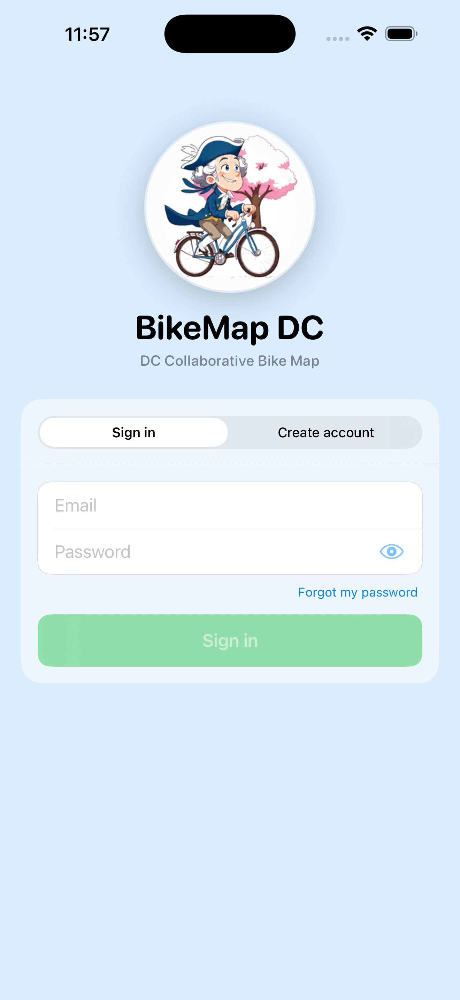

<h1 align="center">
  <br>
  BikeMap DC — Android
</h1>

<p align="center">
  <strong>The DC Collaborative Bike Map.</strong><br>
  A community-curated cycling map for the Washington, D.C. metro area.
</p>

<p align="center">
  <a href="#features">Features</a> ·
  <a href="#screenshots">Screenshots</a> ·
  <a href="#stack">Stack</a> ·
  <a href="#getting-started">Getting started</a> ·
  <a href="#data-sources">Data sources</a> ·
  <a href="#license">License</a>
</p>

---

BikeMap DC pulls together everything a cyclist needs in DC — protected bike
lanes, Capital Bikeshare stations, fix-it stands, bike shops, water fountains,
public transit, four years of crash data, and live community contributions —
into one fast, ad-free Android app.

## Features

- 🗺️ **Full coverage map** of DC, Arlington, Alexandria, Falls Church, Tysons,
  Bethesda, Silver Spring, Capitol Heights, College Park, Hyattsville, New
  Carrollton, and Suitland.
- 🚴 **5,500+ bike-infrastructure segments** — 9 categories matching the
  goDCgo legend (protected, conventional, contraflow, bus/bike, shared/sharrow,
  signed route, off-street trail, unpaved trail, mountain bike).
- 📍 **5,700+ points of interest** — bike parking, Capital Bikeshare,
  fix-it stands, bike shops, water fountains, public restrooms, Metro,
  commuter rail, rec centers, landmarks.
- 💥 **1,700+ cyclist crash locations** from the past 4 years of DC Vision
  Zero data.
- ➕ **Add your own points** with a literally draggable mini-map pin
  (touch the marker and slide it across the map).
- 🚨 **Report bike thefts** with photo upload to Supabase Storage and
  community push notifications.
- ⚠️ **Report cyclist accidents** with the same safety-first flow.
- 🔒 **Bike registry** — nickname, brand, color, serial, details, photo,
  with Conventional / E-bike toggle.
- 👮 **Admin moderation panel** — review pending submissions, edit titles /
  descriptions / pin locations before approving, delete misplaced markers.
- 🌐 **English + Latin American Spanish** — locale picker takes effect
  instantly without an app restart.
- 📍 **Live user-location** dot with accuracy halo.
- 🛡️ **5-mile contribution gate** so submissions stay accurate.

## Screenshots

<p align="center">
  
</p>

## Stack

- **Flutter 3.41** + **Dart 3.11**
- **flutter_map** (Leaflet-style raster tiles from OSM) + **latlong2**
- **supabase_flutter** for auth, postgres, storage, edge functions
- **geolocator** for live user location + distance math
- **image_picker** for bike & theft-report photo uploads
- **provider** for app state · **shared_preferences** for the locale picker
- Material 3, English + es-419 via `flutter_localizations`

Same Supabase backend as the [iOS app](https://github.com/eu2001/bikemap-dc-ios):
Postgres + RLS + ~10 Edge Functions running on the public DC project.

## Getting started

Prerequisites: Flutter 3.41+ and either Android Studio or just the Android SDK.

```bash
git clone git@github.com:eu2001/bikemap-dc-android.git
cd bikemap-dc-android
flutter pub get

# Connect a device or boot an emulator, then:
flutter run
```

### Building a signed release AAB

This repo does **not** include the upload keystore (it's gitignored). To build
a release Play Store bundle locally:

1. Generate your own keystore:
   ```bash
   keytool -genkeypair -v \
     -keystore android/upload-keystore.jks \
     -keyalg RSA -keysize 2048 -validity 9125 \
     -alias upload
   ```
2. Create `android/key.properties` (gitignored):
   ```
   storePassword=...
   keyPassword=...
   keyAlias=upload
   storeFile=../upload-keystore.jks
   ```
3. Build:
   ```bash
   flutter build appbundle --release
   ```
   Output: `build/app/outputs/bundle/release/app-release.aab` (~47 MB).

Bundle ID is `com.bikemap.dc`. To run on a device you'll need USB debugging
enabled.

## Data sources

| Source | Used for |
|---|---|
| [DDOT — District Department of Transportation](https://opendata.dc.gov/) | Bike lanes, bike parking, Capital Bikeshare station registry |
| [DCGIS](https://maps2.dcgis.dc.gov/dcgis/rest/services/DCGIS_DATA) | Metro stations, MARC/VRE stops, signed routes, rec centers |
| [Capital Bikeshare GBFS](https://gbfs.capitalbikeshare.com/gbfs/gbfs.json) | Live station roster |
| [WMATA](https://www.wmata.com/schedules/maps/) | Metrorail roster cross-reference |
| [MPD Vision Zero](https://opendata.dc.gov/datasets/DCGIS::crashes-in-dc) | Cyclist injury / fatality crashes |
| [OpenStreetMap](https://www.openstreetmap.org/copyright) | Bike shops, fix-it stands, water fountains, trailheads, MTB trails, bus/bike lanes |
| [goDCgo](https://godcgo.com) | Map legend & coverage area reference |

All imported data is attributed to its original source on every row.

## Companion projects

- **iOS** sibling: [`bikemap-dc-ios`](https://github.com/eu2001/bikemap-dc-ios) — same backend, native SwiftUI
- **Support & user guide**: https://sites.google.com/view/bikemapdc
- **Privacy policy**: https://sites.google.com/view/bikemapdc/privacy

## Contributing

PRs welcome for bug fixes, accessibility, and translations. For data
corrections (a missing fix-it stand, a closed bike shop, etc.) email
**bikemap.dc@gmail.com** with the point's reference code — every point in the
app shows its code in the title (e.g. `BP4231` for Bike Parking #4231).

## License

[MIT](LICENSE) — do what you want with the code; please don't blame us if
something goes wrong.

The imported map data remains under the licenses of its original sources
(DDOT, DCGIS, OpenStreetMap ODbL, etc.).
